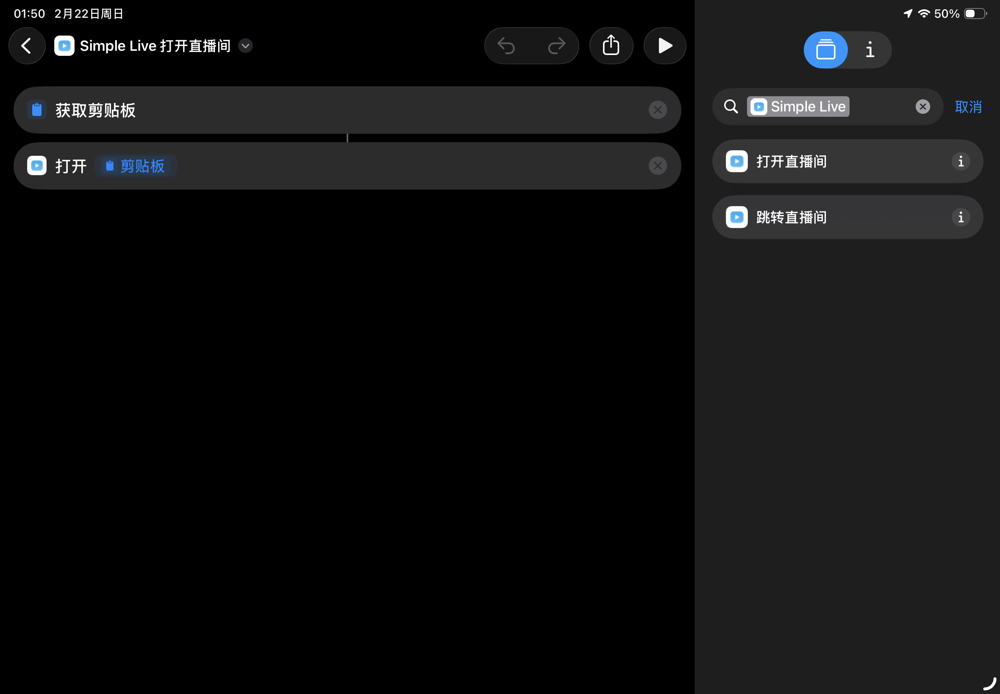

# 快捷指令 & URL Scheme

## iOS 快捷指令

### 方式一：原生动作（iOS 16+，推荐）

iOS 16 及以上系统，Simple Live 已原生集成「快捷指令」，无需手动创建：

1. 打开「快捷指令」App
2. 搜索 **"Simple Live"** 或 **"打开直播间"**
3. 可以看到两个原生动作：
   - **打开直播间** — 输入直播链接，自动解析并跳转
   - **跳转直播间** — 选择平台 + 输入房间号，直接跳转

也支持 Siri 语音触发：「用 Simple Live 打开直播间」。



### 方式二：手动创建（适用于所有 iOS 版本）

打开 iOS「快捷指令」App，按以下步骤创建一个「复制链接 → 一键跳转」的快捷指令：

1. 点击右上角 `+` 新建快捷指令，命名为 **"Simple Live 打开直播间"**
2. 依次添加 3 个动作：
   - **获取剪贴板**
   - **对 URL 编码**（输入设为上一步的「剪贴板」）
   - **打开 URL**（填写 `simplelive://open?url=已编码的URL`，其中「已编码的URL」选择上一步的魔法变量）
3. 可选：点击详情 `...` →「添加到主屏幕」，生成桌面图标

使用时：复制一个直播链接 → 触发快捷指令 → Simple Live 自动跳转。

## 支持的平台和链接

| 平台 | 平台 ID | 链接示例 |
|---|---|---|
| 哔哩哔哩 | `bilibili` | `https://live.bilibili.com/xxxxx`、`https://b23.tv/xxxxx` |
| 斗鱼直播 | `douyu` | `https://www.douyu.com/xxxxx`、`https://www.douyu.com/topic/xxx?rid=xxx` |
| 虎牙直播 | `huya` | `https://www.huya.com/xxxxx` |
| 抖音直播 | `douyin` | `https://live.douyin.com/xxxxx`、`https://v.douyin.com/xxxxx` |

## URL Scheme

iOS / Android / macOS 均支持 `simplelive://` URL Scheme，可用于自动化工具或第三方集成：

```
# 传入直播链接，自动识别平台并跳转
simplelive://open?url=<URL编码后的直播链接>

# 直接指定平台和房间号跳转
simplelive://room?site=<平台ID>&roomId=<房间号>
```

示例：

```
simplelive://open?url=https%3A%2F%2Flive.bilibili.com%2F12345
simplelive://room?site=bilibili&roomId=12345
```

Android 也可通过 ADB 触发：

```sh
adb shell am start -a android.intent.action.VIEW -d "simplelive://open?url=https%3A%2F%2Flive.bilibili.com%2F12345"
```
